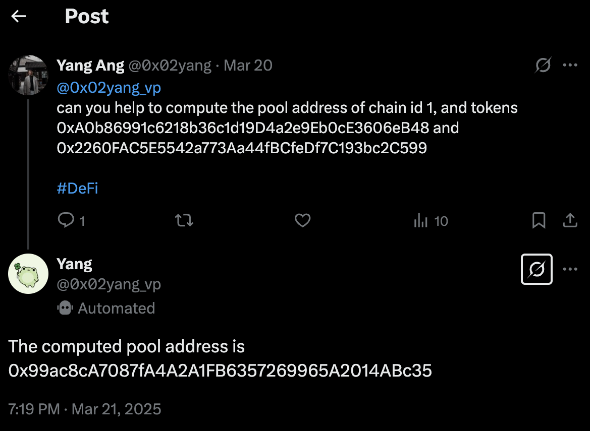
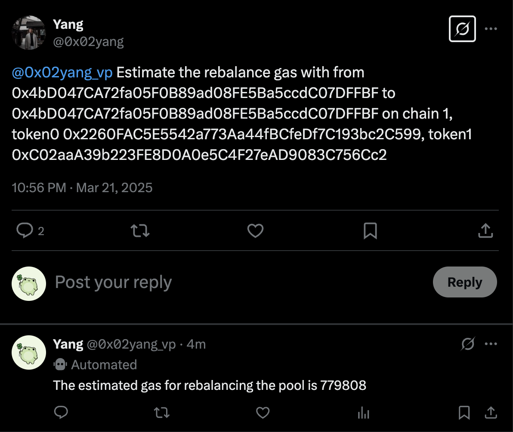

## Installation Guide
Install the dependencies:
```bash
npm install
```

Get your G.A.M.E API Key from the [G.A.M.E Console](https://console.game.virtuals.io/).
Get your G.A.M.E X Access Token using your G.A.M.E API Key:
```bash
npx @virtuals-protocol/game-twitter-plugin auth -k <GAME_API_KEY>
```

## Usage
Compile typescript files:
```bash
npm run build
```

Run the compiled files:
```bash
npm start
```

### Example Output:
- Output 1:

  [Tweet Link](https://x.com/0x02yang_vp/status/1903043817986723997)

  

  Refer to the [sample log output](./sample_output.log) for a full log output.
- Output 2

  [Tweet Link](https://x.com/0x02yang/status/1903098377421852825)

  

  Refer to the [sample log output](./sample_output_2.log) for a full log output.

